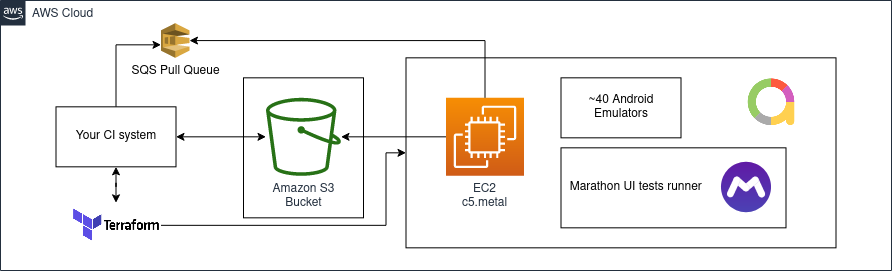

# Run Android Espresso/Kaspresso UI tests in AWS



## requirements:

terraform to create and destroy aws resources - https://learn.hashicorp.com/tutorials/terraform/install-cli

aws cli to create s3 bucket and custom ami - https://docs.aws.amazon.com/cli/latest/userguide/getting-started-install.html

aws access key and secret key for terraform and aws cli - https://console.aws.amazon.com/iamv2/home?#/users

allure cli to check ui test run reports - https://docs.qameta.io/allure/#_installing_a_commandline


## setup

### 1. add aws creds to current shell session
```
export AWS_ACCESS_KEY_ID=xxx
export AWS_SECRET_ACCESS_KEY=xxx
export AWS_DEFAULT_REGION=us-east-2
```

### 2. create s3 bucket for apks, marathon ui tests runner and ui test run reports and upload marathon runner
```
aws s3 mb s3://<use-globally-unique-name-here>

# upload marathon ui tests runner to s3
wget https://github.com/MarathonLabs/marathon/releases/download/0.6.5/marathon-0.6.5.zip
mv marathon-0.6.5.zip marathon.zip
unzip marathon.zip -d m_dir && \
rm marathon.zip
ci_file_names=$(ls m_dir | xargs)
marathon_name=$(eval "bash -c 'compgen -W \"$ci_file_names\" -- \"marathon\"'")
mv m_dir/"$marathon_name" m_dir/marathon
aws s3 sync m_dir/marathon s3://<use-globally-unique-name-here>/marathon
rm -rf m_dir
```
also replace my-tf-test-bucket-dc with your created s3 bucket name in scripts

### 3. create Amazon Machine Image (ami) with docker, android sdk and pulled container image of android emulator
```
./run_ui_tests.sh # as main.tf uses ami without docker by default it will be dry run without tests
```

### 4. find ip in stdout or using aws web console if it is null and connect using ssh
```
# in separate shell session run:
ssh -i terraform_ec2_key.pem ec2-user@<paste-ip-here>
```

```
# run inside vm
sudo yum update -y
sudo amazon-linux-extras install docker -y
sudo yum install docker -y
sudo service docker enable
sudo service docker start
sudo usermod -aG docker $USER && newgrp docker
docker pull materkey/android-emulator-29:smp2c9e604744de4

sudo yum -y install unzip java
sudo mkdir -p /opt/android-sdk/cmdline-tools
export ANDROID_HOME=/opt/android-sdk
export PATH=$PATH:$ANDROID_HOME/tools/:$ANDROID_HOME/platform-tools:$ANDROID_HOME/platform-tools/bin:$ANDROID_HOME/tools/bin:$ANDROID_HOME/cmdline-tools/latest/bin
# https://developer.android.com/studio/index.html#command-tools
export ANDROID_SDK_URL=https://dl.google.com/android/repository/commandlinetools-linux-7302050_latest.zip
export ANDROID_SDK_FILE_NAME=android-sdk.zip

curl $ANDROID_SDK_URL --progress-bar --location --output $ANDROID_SDK_FILE_NAME && \
  sudo unzip $ANDROID_SDK_FILE_NAME -d $ANDROID_HOME/cmdline-tools && \
  rm -f $ANDROID_SDK_FILE_NAME && sudo mv $ANDROID_HOME/cmdline-tools/cmdline-tools $ANDROID_HOME/cmdline-tools/latest

sudo touch $ANDROID_HOME/packages.txt
sudo chmod 777 $ANDROID_HOME/packages.txt
{
  echo "platform-tools"
  echo "tools"
  echo "extras;google;m2repository"
} >> $ANDROID_HOME/packages.txt

 Update sdk and install components
mkdir $HOME/.android && \
  echo "y" | sudo /opt/android-sdk/cmdline-tools/latest/bin/sdkmanager --verbose \
    --sdk_root=$ANDROID_HOME \
    --package_file=$ANDROID_HOME/packages.txt && \
  sudo chmod -R o+rwX $ANDROID_HOME

sudo yum -y install android-tools
sudo pip3 install awscli --force-reinstall --upgrade
```

### 5. create ami to use it later for ui test runs then replace main.tf ami with this new ami
```
aws ec2 create-image --instance-id <paste instance id here example: i-0ab5b74e8629750c9> --name "Android UI tests" --description "An AMI for android UI tests"
```

### 6. now you can try to run ui tests example run (currently it uses https://github.com/MarathonLabs/marathon)
```
./run_ui_tests.sh
```
after run terraform will destroy aws objects created by ```terraform apply```

### 7. to delete all resourses run
```
terraform destroy -auto-approve
```
### 8. check results in <task-name>/build/reports/

### run can take ~15-20 minutes there is a room for improvement (you can add issues with ideas)
- 3 min init instance
- 5-7 min run emulators
- 2 min kaspresso sample test run
- 5 min destroy aws resources

### you can write similar scripts for Google Cloud
```
find some info here: https://github.com/google/android-emulator-container-scripts/tree/master/cloud-init
```

### also you can build your own android emu docker image based on https://github.com/avito-tech/avito-android/tree/develop/ci/docker

also this is a version that decoupled from avito infrastructure: https://github.com/materkey/avito-android/tree/dc-fresh/ci/docker
also you can run everything in your own k8s cluster using avito UI tests runner but in is a bit longer story, I can tell it later

```
# 1. build docker-in-docker-image, set env IMAGE_DOCKER_IN_DOCKER
# 2. set some env needed for https://github.com/materkey/avito-android/blob/dc-fresh/ci/docker/publish_emulator.sh if you need to push results (DOCKER_REGISTRY, DOCKER_LOGIN, DOCKER_PASSWORD)
# 3. and then run:
./publish_emulator.sh android-emulator 29
```

### to show logs you can run this inside vm
```
sudo cat /var/log/cloud-init-output.log
```

### this scripts uses kaspresso sample: https://github.com/KasperskyLab/Kaspresso/tree/master/samples/kaspresso-sample

### aws pricing calculations: https://docs.google.com/spreadsheets/d/1PeuTR52vEG0Puv_GRISGrkKroltZ9OjbgfL1OCcepW4/edit#gid=0

### possible issues
1. sometimes spot instance request can infinitely be in pending state. try to change availability zone and/or spot_price in main.tf